<div align="center">

# 🗳️ PollPulse: Live Voting at Scale

### Millions of votes. Counted exactly once.

A live voting platform built to learn how to **split data across many machines and keep it correct**.<br/>
Sharding, replication, SQL vs NoSQL, consistency models and the CAP theorem, all running on your laptop.


**[▶ Watch the demo](#-demo)** · **[🏗️ Architecture](#4-high-level-architecture)** · **[🧪 Try the demos](#-run-the-demos)** · **[🚀 Run it](#16-how-to-run)**

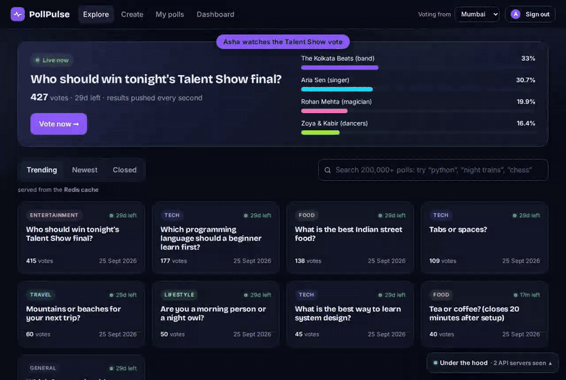

<sub>A crowd votes from Mumbai, Frankfurt and Virginia. Asha votes from Frankfurt, then watches the bars and the region split update every second.</sub>

</div>

---

## 🎬 Demo

<div align="center">

<a href="docs/demo/full-demo.mp4"></a>

**[▶ Watch the full demo video (2 min 15 s)](docs/demo/full-demo.mp4)**<br/>
<sub>Live results · one person, one vote · replication lag · indexes · vote storm on the dashboard</sub>

</div>

| Demo | What it shows |
|---|---|
| [🗳️ Live voting](#-demo) (above) | Votes from three regions; results pushed to every screen once a second |
| [☝️ One person, one vote](#83-one-person-one-vote) | The same vote sent again and again, to different servers at once. Counted once. |
| [⏳ Where did my poll go?](#85-replication-and-read-your-writes) | The read replica is behind, and the fix called "read-your-writes" |
| [🔎 Indexes on 200,000 polls](#89-indexing) | The same queries with and without indexes: up to 3,000× faster |
| [🌪️ Vote storm](#9-live-dashboard) | A load test sends 100 votes per second; the dashboard shows every part of the system |

---

## 🧠 What you will learn from this project

| Concept | Where it shows up |
|---|---|
| ✅ SQL vs NoSQL: choosing the right store for each kind of data | [8.1](#81-sql-vs-nosql-two-databases-on-purpose) |
| ✅ Sharding and choosing a shard key (and the "hot shard" mistake) | [8.2](#82-sharding-and-the-shard-key) |
| ✅ Uniqueness and idempotency without locks | [8.3](#83-one-person-one-vote) |
| ✅ Hot spots and sharded counters | [8.4](#84-counting-without-a-hot-spot) |
| ✅ Replication, replication lag and read-your-writes | [8.5](#85-replication-and-read-your-writes) |
| ✅ Consistency models: strong, eventual, causal | [8.6](#86-consistency-models) |
| ✅ CAP theorem and network partitions, for real | [8.7](#87-cap-theorem-and-network-partitions) |
| ✅ Automatic failover and leader election in a replica set | [8.8](#88-failover) |
| ✅ Database indexing, measured with `EXPLAIN ANALYZE` | [8.9](#89-indexing) |
| ✅ Pushing live updates with Server-Sent Events | [8.10](#810-live-results-server-sent-events) |

---

## 📚 Part of a 5-project System Design series

| # | Project | Focus | Status |
|---|---------|-------|--------|
| 1 | Live Event Ticketing & Seat Reservation | Handle traffic: load balancing, caching, rate limiting, API design | ✅ Done |
| **2** | **Collaborative Polling & Live Voting** *(this repo)* | Handle distributed data: SQL vs NoSQL, indexing, replication, sharding, CAP | ✅ Done |
| 3 | Food Delivery Order Orchestration | Handle distributed services: queues, Kafka/RabbitMQ, pub-sub, microservices | 🔜 |
| 4 | Podcast / Audio Streaming Platform | Handle large-scale storage: object storage, CDN, feeds, fan-out | 🔜 |
| 5 | Multiplayer Real-Time Trivia | Bring it together: WebSockets, failover, leader election, auth, observability | 🔜 |

**What carries over from Project 1:** the Nginx load balancer, stateless API servers, Redis caching with stampede protection, per-user rate limiting (token bucket), idempotency and the live dashboard. This project adds the **data layer** underneath.

---

## Table of contents

1. [Problem Statement](#1-problem-statement)
2. [Requirements](#2-requirements)
3. [Capacity Estimation](#3-capacity-estimation)
4. [High-Level Architecture](#4-high-level-architecture)
5. [Screens Tour](#5-screens-tour)
6. [Data Design](#6-data-design)
7. [API Design](#7-api-design)
8. [Deep Dives](#8-deep-dives)
9. [Live Dashboard](#9-live-dashboard)
10. [Failure Scenarios](#10-failure-scenarios)
11. [Trade-offs & Alternatives Considered](#11-trade-offs--alternatives-considered)
12. [Load Test Results](#12-load-test-results)
13. [Limitations & What I'd Do Differently](#13-limitations--what-id-do-differently)
14. [Tech Stack](#14-tech-stack)
15. [Project Structure](#15-project-structure)
16. [How to Run](#16-how-to-run)

---

## 1. Problem Statement

A TV talent show says: **"Vote now! Lines close in 5 minutes."** Ten million people pick up their phones at the same moment, and everyone wants to see the results change live.

In Project 1, one database could keep up because the waiting room **slowed the crowd down**, and most people were only *looking* at seats. A live vote breaks both tricks:

| Problem | What it means |
|---|---|
| ✍️ **Almost everything is a write** | Every vote is a new record. Caching doesn't help with writes. |
| ⏱️ **You can't make people wait** | Voting closes in 5 minutes. A queue would make people miss it. |
| 🎯 **Everyone hits the same poll** | All the writes aim at the same thing at the same time: a perfect hot spot. |
| 🌍 **Voters are everywhere** | Mumbai, Frankfurt, Virginia. Data must be copied between regions, and results must still make sense. |
| ☝️ **One person, one vote** | Even with retries, double taps and many servers, each person counts exactly once. |

**The goal:** split the votes across many machines so no single machine is the bottleneck, keep copies in several regions so nothing is lost, and still count every vote exactly once.

## 2. Requirements

### What the system must do (functional requirements)

- 🆕 Create a poll with 2-6 options, a closing time and public or link-only visibility.
- 🗳️ Vote **once per person per poll**. Sending the same vote again is safe; changing it is not allowed.
- 📈 See results update **live** (about every second) while the poll is open.
- 🔎 Browse **trending**, **newest** and **closed** polls, and **search** over hundreds of thousands of polls.
- 🏁 When a poll closes, publish **exact** final results.

### How well it must do it (non-functional requirements)

| Requirement | Target | How we achieve it |
|---|---|---|
| **Write throughput** | Designed for ~100,000 votes/s at peak | Votes sharded across MongoDB shards; no single hot document ([8.2](#82-sharding-and-the-shard-key), [8.4](#84-counting-without-a-hot-spot)) |
| **Durability** | An accepted vote is never lost, even if a server dies | Written to a majority of replicas (`w: majority`) before we say "counted" ([8.8](#88-failover)) |
| **Correctness** | One vote per person, always | The vote's `_id` is `pollId:userId`; the database rejects duplicates ([8.3](#83-one-person-one-vote)) |
| **Live results** | May be ~1-2 s behind while voting is open | Sharded counters + a 1 s cache + push to browsers ([8.10](#810-live-results-server-sent-events)) |
| **Final results** | Exact | Full recount of every vote when the poll closes ([8.4](#84-counting-without-a-hot-spot)) |
| **Availability** | Results stay visible during failures | Live results read from any reachable copy (AP), votes refuse rather than risk loss (CP) ([8.7](#87-cap-theorem-and-network-partitions)) |
| **Fast browsing** | Search 200,000+ polls in milliseconds | Read replica + indexes ([8.5](#85-replication-and-read-your-writes), [8.9](#89-indexing)) |

## 3. Capacity Estimation

> [!NOTE]
> Rough math before building, to find out where a single machine breaks.

A national TV vote: **10 million voters** in a **5-minute** window.

| What | Math | Result |
|---|---|---|
| Average vote rate | 10,000,000 ÷ 300 s | ~33,000 votes/s |
| Peak (first minute) | ~3× average | **~100,000 votes/s** |
| Database writes per vote | 1 vote document + 1 counter increment | **~200,000 writes/s** at peak |
| Storage per vote | ~200 bytes × 10M votes | ~2 GB per big poll, **~6 GB** with 3 copies |
| People watching results | 10M viewers × 1 update/s | **10M messages/s** → results must be cached and *pushed*, never recomputed per viewer |

**What one machine can do:** a single database primary handles roughly 5,000-20,000 simple writes per second, depending on hardware and how many copies must confirm each write.

**So:**

- 🧮 200,000 writes/s ÷ ~15,000 per shard ≈ **14 shards**, so plan for **~16-20 shards** with headroom.
- 🔥 If every vote updated one `count` field, that one document would need 100,000 updates/s. **Impossible.** Hence sharded counters ([8.4](#84-counting-without-a-hot-spot)): 4 options × 3 regions × 16 counters = 192 documents, so ~520 updates/s each. Easy.
- 📡 Live results are computed **once per second per API server**, no matter how many people watch. Each viewer just receives a copy.

> [!IMPORTANT]
> **The key idea:** you can't cache writes, so you have to **split** them (sharding) and **avoid shared hot spots** (sharded counters). Reads you **copy** (replicas) and **cache**.

This repository runs the same design at laptop size: **2 shards × 3 regions** in MongoDB, a PostgreSQL primary with 1 read replica, and 3 API servers, one per region.

## 4. High-Level Architecture

<div align="center">
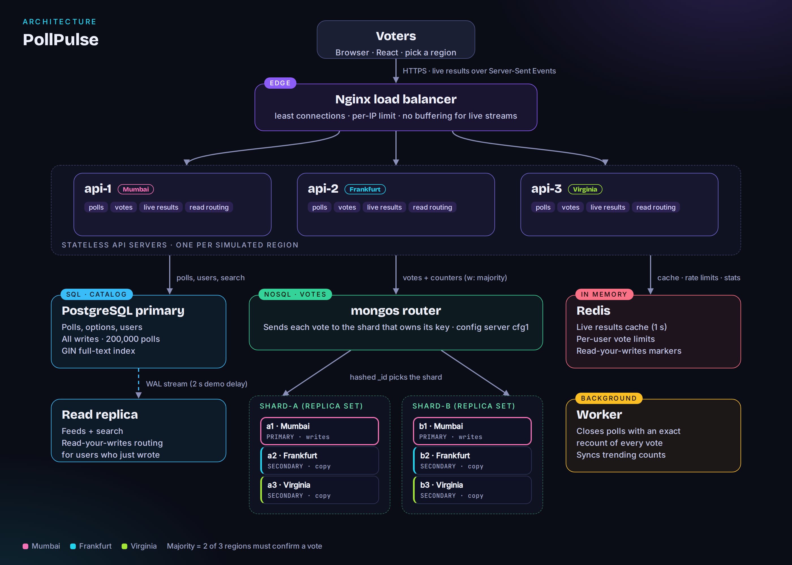
</div>

### What each part does, in simple words

| Part | Its job | Why it's there |
|---|---|---|
| 🌐 **Nginx** | The front door. Serves the website and spreads API requests over 3 servers. | Same as Project 1, plus it streams live results without buffering them. |
| 🖥️ **API servers (×3)** | All the logic. Each one pretends to run in a different region. | Stateless: any server can answer any request, and one can die safely. |
| 🐘 **PostgreSQL primary** | Stores polls, options and users. All writes go here. | This data is relational, small and changes rarely: a perfect fit for SQL. |
| 📖 **PostgreSQL read replica** | A continuously updated copy. Feeds and search read from it. | Moves the heavy browsing load off the primary. |
| 🍃 **MongoDB router (`mongos`)** | Receives every vote and sends it to the right shard. | The app talks to one address; the router knows where each vote lives. |
| 🧩 **MongoDB shards (×2)** | Each shard holds part of the votes. Each is a **replica set** with a copy in every region. | Splitting writes across shards is what lets writes scale. Copies in 3 regions keep them safe. |
| ⚡ **Redis** | Live-results cache, rate limits, read-your-writes markers, live stats. | Answers the hottest reads in about a millisecond. |
| ⚙️ **Worker** | Closes polls with an exact recount; keeps "trending" up to date. | Slow, careful work that shouldn't block voters. |

### What happens when you vote

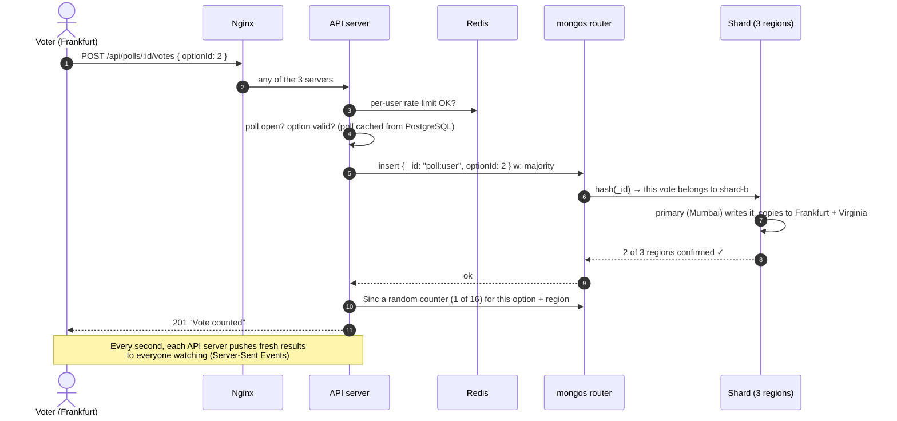
```mermaid
sequenceDiagram
    autonumber
    actor V as Voter (Frankfurt)
    participant N as Nginx
    participant A as API server
    participant R as Redis
    participant M as mongos router
    participant S as Shard (3 regions)

    V->>N: POST /api/polls/:id/votes { optionId: 2 }
    N->>A: any of the 3 servers
    A->>R: per-user rate limit OK?
    A->>A: poll open? option valid? (poll cached from PostgreSQL)
    A->>M: insert { _id: "poll:user", optionId: 2 }  w: majority
    M->>S: hash(_id) → this vote belongs to shard-b
    S->>S: primary (Mumbai) writes it, copies to Frankfurt + Virginia
    S-->>M: 2 of 3 regions confirmed ✓
    M-->>A: ok
    A->>M: $inc a random counter (1 of 16) for this option + region
    A-->>V: 201 "Vote counted"
    Note over A,V: Every second, each API server pushes fresh results<br/>to everyone watching (Server-Sent Events)
```

### Browsing and creating polls

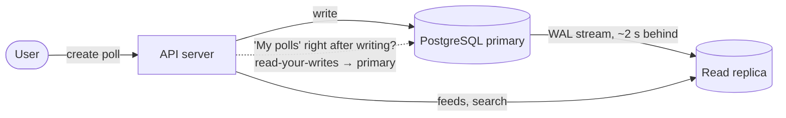
```mermaid
flowchart LR
    U([User]) -->|create poll| API[API server]
    API -->|write| P[(PostgreSQL primary)]
    P -->|WAL stream, ~2 s behind| RP[(Read replica)]
    API -->|feeds, search| RP
    API -.->|"'My polls' right after writing?<br/>read-your-writes → primary"| P
```

## 5. Screens Tour

| Explore: trending, newest, closed + search | Vote: pick one option and a region |
|---|---|
| 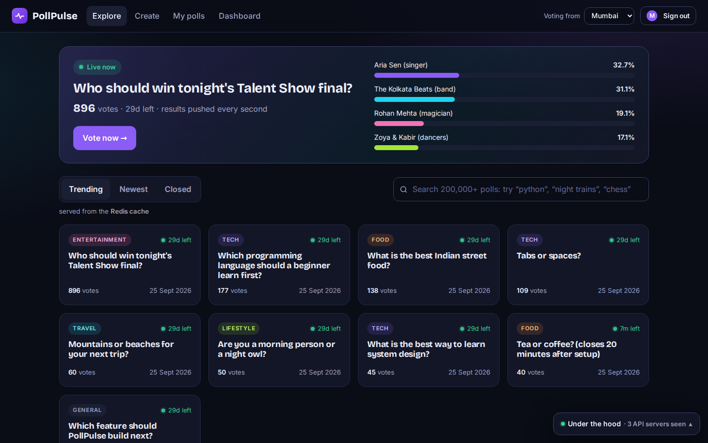 | 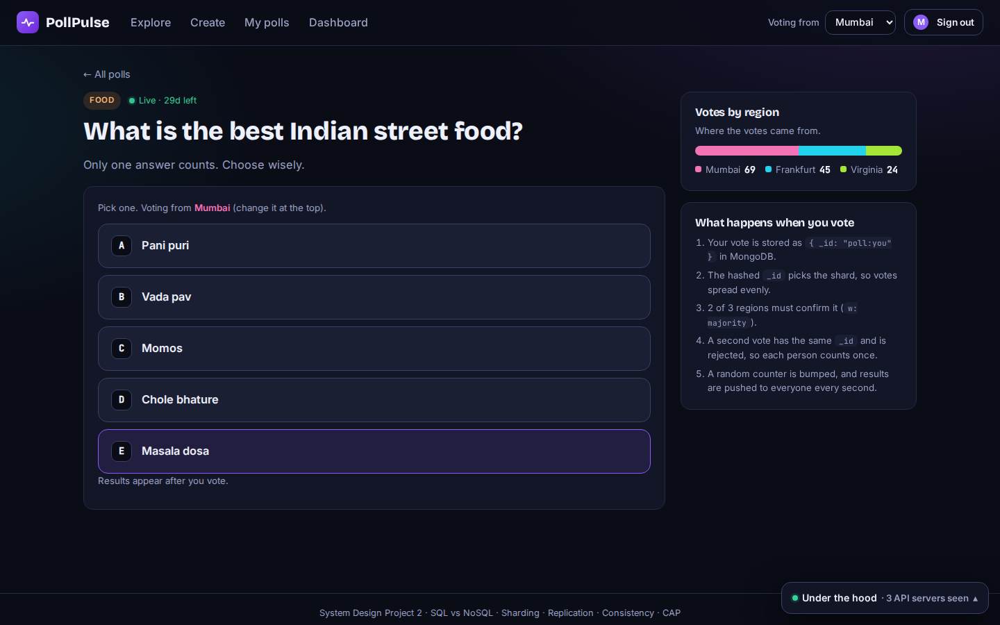 |
| **Live results** pushed every second, with votes by region | **Read my vote back** with strong, eventual and causal reads |
| 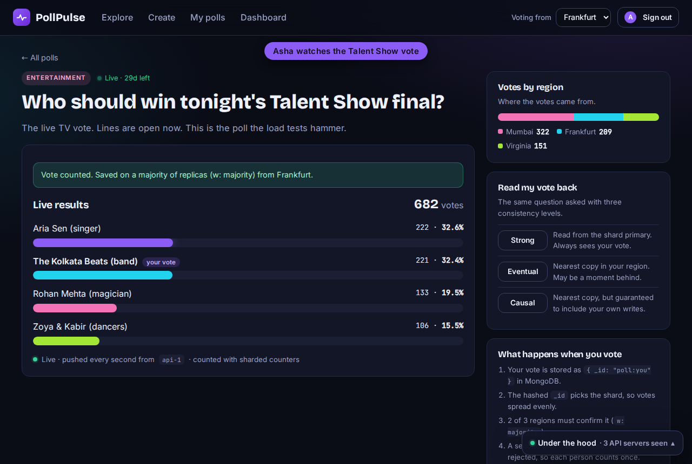 | 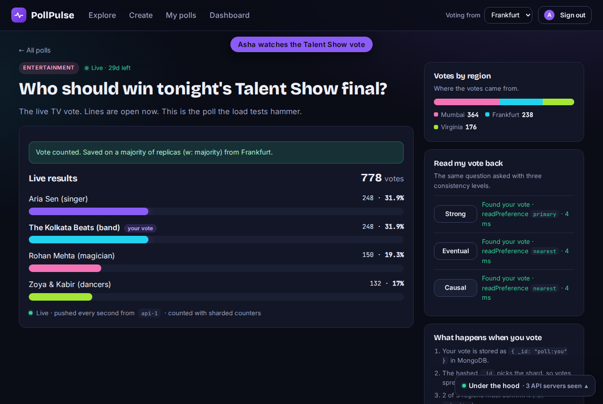 |
| **Search** 200,000+ polls with a full-text index | **Final results** from an exact recount, showing the drift |
| 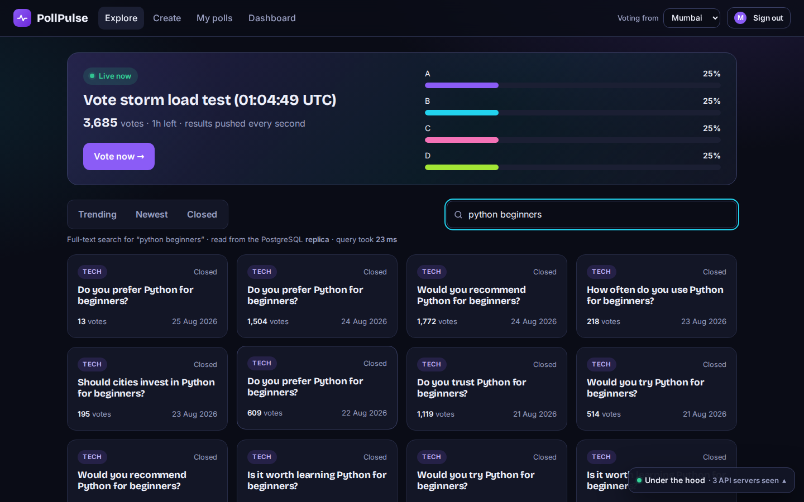 | 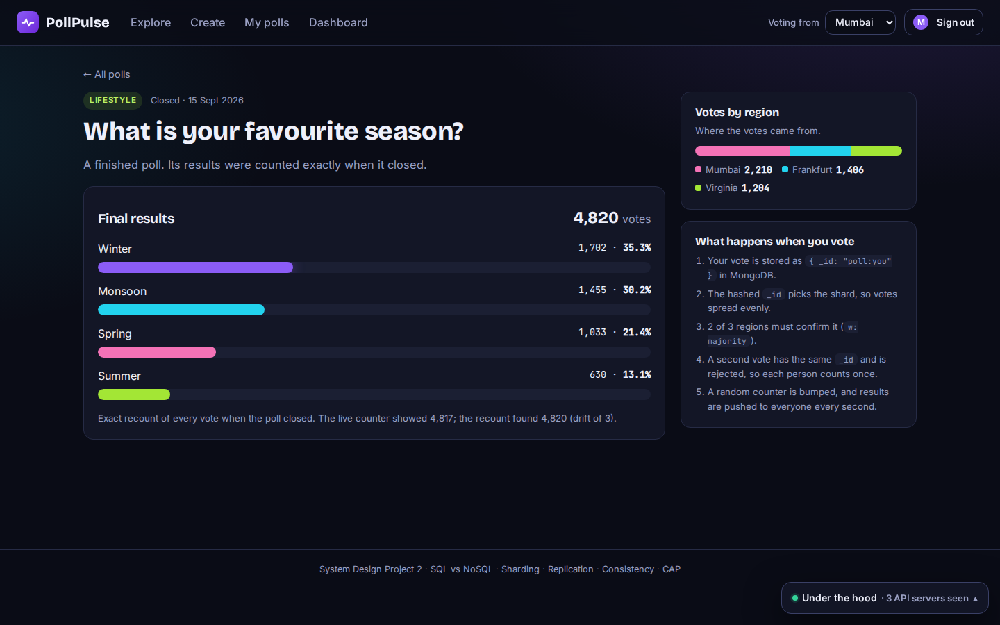 |
| **Create** a poll (saved on the PostgreSQL primary) | **Mobile** |
| 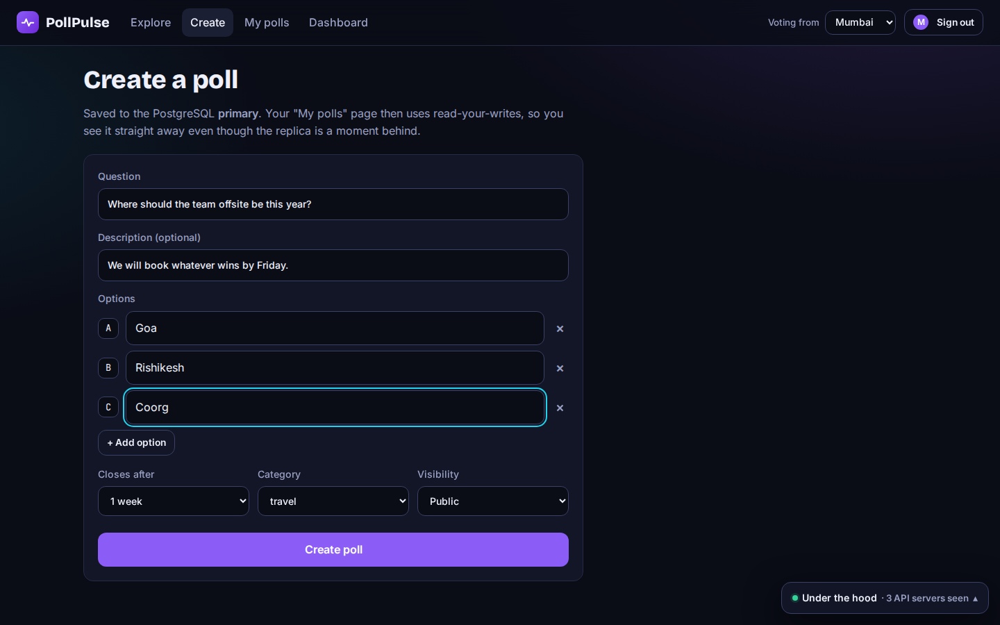 |  |

> [!TIP]
> Every page has an **"Under the hood"** panel (bottom right) showing which API server and region answered each request, whether it was read from the PostgreSQL **primary** or **replica**, the MongoDB read preference, and cache hits.

## 6. Data Design

### PostgreSQL: the catalog (relational, small, read a lot)

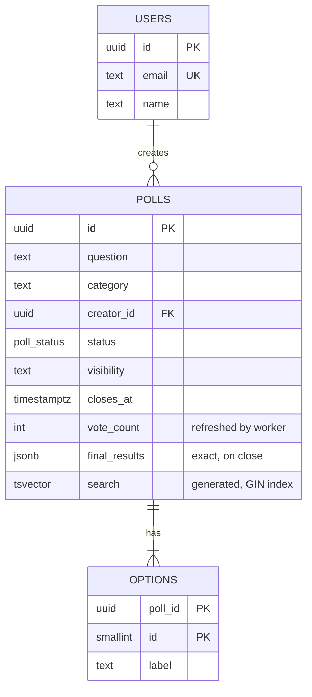
```mermaid
erDiagram
    USERS ||--o{ POLLS : creates
    POLLS ||--|{ OPTIONS : has
    USERS {
        uuid id PK
        text email UK
        text name
    }
    POLLS {
        uuid id PK
        text question
        text category
        uuid creator_id FK
        poll_status status
        text visibility
        timestamptz closes_at
        int vote_count "refreshed by worker"
        jsonb final_results "exact, on close"
        tsvector search "generated, GIN index"
    }
    OPTIONS {
        uuid poll_id PK
        smallint id PK
        text label
    }
```

Full schema: [`db/postgres/01-schema.sql`](db/postgres/01-schema.sql). The seed adds **200,000 closed polls** so that indexes and search have real work to do.

### MongoDB: the votes (huge, write-heavy, looked up by key)

```js
// votes: one document per person per poll. Sharded on { _id: "hashed" }.
{
  _id: "b0000000-...-0001:6f1c...e2",   // "<pollId>:<userId>": the uniqueness rule IS the key
  pollId: "b0000000-...-0001",
  userId: "6f1c...e2",
  optionId: 2,
  region: "frankfurt",
  createdAt: ISODate("2026-09-25T01:02:03Z")
}

// tallies: sharded counters for live results. 16 per (poll, option, region).
{ _id: "b0000000-...-0001:2:frankfurt:11", pollId: "...", optionId: 2, region: "frankfurt", count: 1834 }
```

Cluster setup: [`db/mongo/init-cluster.sh`](db/mongo/init-cluster.sh) and [`db/mongo/init-sharding.js`](db/mongo/init-sharding.js).

## 7. API Design

All endpoints start with `/api`. ✅ = needs a login token (`Authorization: Bearer <jwt>`).

| Method | Endpoint | Login | What it does | Reads from |
|---|---|---|---|---|
| `POST` | `/auth/login` | – | Demo sign-in → token | PG primary |
| `GET` | `/polls?sort=trending\|new\|closed` | – | Poll feeds | PG **replica**, cached 5 s |
| `GET` | `/polls?q=night trains` | – | Full-text search | PG **replica** (GIN index) |
| `GET` | `/polls/:id` | – | One poll + options | cache → replica → primary if missing |
| `POST` | `/polls` | ✅ | Create a poll | PG **primary** |
| `GET` | `/polls/mine` | ✅ | My polls (`?ryw=off` turns read-your-writes off) | replica, or primary if you just wrote |
| `POST` | `/polls/:id/votes` | ✅ | Vote `{ optionId, region }` | MongoDB, `w: majority` |
| `GET` | `/polls/:id/my-vote?consistency=strong\|eventual\|causal&region=` | ✅ | Read your vote back | MongoDB primary / nearest copy |
| `GET` | `/polls/:id/results` | – | Live (or final) results | sharded counters, cached 1 s |
| `GET` | `/polls/:id/stream` | – | **Server-Sent Events**: results pushed every second | same as above |
| `GET` | `/ops/overview` | – | Everything the dashboard shows | Redis, PG, MongoDB |
| `GET` | `/health` | – | Server health (PG primary, replica, MongoDB, Redis) | all |

**Vote responses:**

| Status | Meaning |
|---|---|
| `201 COUNTED` | New vote, confirmed by a majority of regions |
| `200 ALREADY_COUNTED` | You sent the same vote again (retry, double tap). Safe, counted once. |
| `409 ALREADY_VOTED` | You tried to change your vote. Votes are final. |
| `409 POLL_CLOSED` | Too late |
| `429 RATE_LIMITED` | Slow down (`Retry-After` header) |
| `503 VOTE_NOT_CONFIRMED` | Not enough regions confirmed in time. **Retry: it can never double-count.** |
| `503 VOTE_STORE_UNAVAILABLE` | That shard has no primary right now (election in progress) |

**Helpful headers:** `X-Served-By`, `X-Region`, `X-Read-From` (`primary` / `replica` / `cache`), `X-Read-Preference`, `X-Cache`.

## 8. Deep Dives

### 8.1 SQL vs NoSQL: two databases on purpose

> [!NOTE]
> **In simple words:** there is no "best database". Polls are like a neat filing cabinet: few, related, searched in many ways. Votes are like a flood of tickets: billions, all alike, only ever looked up by one key. Different jobs, different tools.

| | **Polls, options, users** | **Votes** |
|---|---|---|
| How many | Thousands to millions | Billions |
| How often written | Rarely (create a poll) | Constantly (the whole point) |
| How read | Many ways: feeds, search, filters, joins | One way: by key (`pollId:userId`), plus counting |
| Needs | Relations, rich queries, full-text search | Scale writes horizontally, stay available |
| **Choice** | **PostgreSQL** (+ read replica) | **MongoDB** (sharded, replica sets) |

**Why not put everything in one?**
- *All in PostgreSQL:* works up to one primary's write limit (~10k/s). Sharding PostgreSQL is possible (Citus, or doing it by hand in the app), but you have to build much more yourself.
- *All in MongoDB:* possible, but feeds, search and relations are more natural in SQL, and you'd give up a mature full-text index.

### 8.2 Sharding and the shard key

> [!NOTE]
> **In simple words:** sharding means splitting one big table into pieces that live on different machines. The **shard key** is the rule that decides which piece each record goes to. Choose it badly and one machine does all the work.

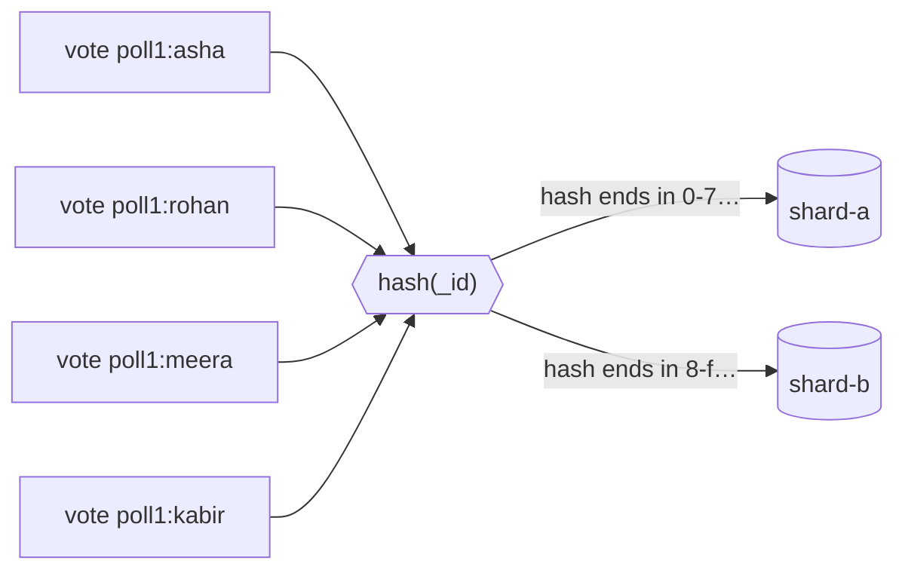
```mermaid
flowchart LR
    V1["vote poll1:asha"] --> H{{"hash(_id)"}}
    V2["vote poll1:rohan"] --> H
    V3["vote poll1:meera"] --> H
    V4["vote poll1:kabir"] --> H
    H -->|"hash ends in 0-7…"| A[("shard-a")]
    H -->|"hash ends in 8-f…"| B[("shard-b")]
```

**Choosing the key for votes:**

| Shard key | What happens with one viral poll | Verdict |
|---|---|---|
| `{ pollId: 1 }` | Every vote has the same key → one chunk → **one shard does 100% of the work** | ❌ Hot shard |
| `{ createdAt: 1 }` | All new votes go to the "latest" chunk → one shard | ❌ Hot shard |
| `{ userId: 1 }` | Spreads well, but "one vote per user **per poll**" is not enforced | ⚠️ |
| **`{ _id: "hashed" }` with `_id = pollId:userId`** | Spreads evenly **and** the database enforces one vote per person | ✅ **Chosen** |

**The trade-off:** asking "give me all votes for poll X" now has to ask **every** shard (scatter-gather). That's fine, because the busy path never does it. Live results read the small counter documents instead, and only the worker scans all votes, once, when a poll closes.

**See it yourself:** `npm run demo:shard-key` loads 20,000 votes for one viral poll into two collections that differ only in their shard key, then shows where the data went and how queries are routed. With the hashed key the votes split roughly 50% / 50%. With `{ pollId: 1 }` they all land on one shard, in a single "jumbo" chunk that can never be split.

### 8.3 One person, one vote

> [!NOTE]
> **In simple words:** each vote is saved under the name "this poll : this person". A database can't have two records with the same name, so a second vote is simply refused. No locks, no "have you voted?" lookup first.

<div align="center">
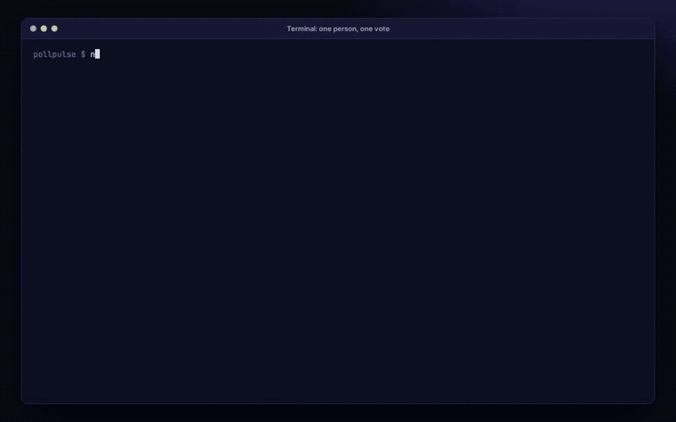
</div>

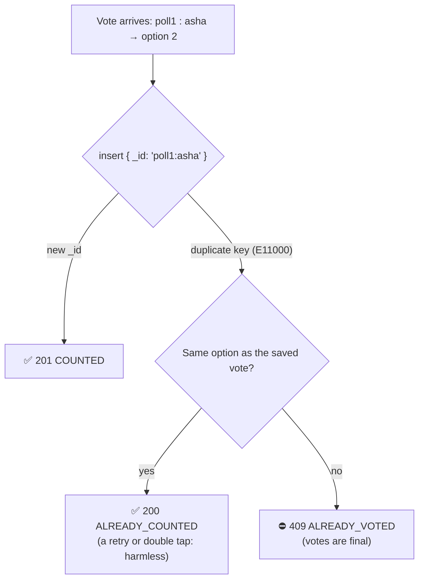
```mermaid
flowchart TD
    A["Vote arrives: poll1 : asha → option 2"] --> B{"insert { _id: 'poll1:asha' }"}
    B -->|new _id| C[✅ 201 COUNTED]
    B -->|"duplicate key (E11000)"| D{"Same option as the saved vote?"}
    D -->|yes| E["✅ 200 ALREADY_COUNTED<br/>(a retry or double tap: harmless)"]
    D -->|no| F["⛔ 409 ALREADY_VOTED<br/>(votes are final)"]
```

Why this is safe even on a sharded cluster: `_id` is the shard key, so MongoDB can guarantee it is unique **across all shards**. Two requests for the same `_id` always go to the same shard, and only one insert can win.

Two layers protect the system:
1. **The database** removes duplicates: 5 identical votes sent at the same instant through 3 different API servers → exactly **1 counted**, 4 × `ALREADY_COUNTED`.
2. **The rate limiter** (per user, token bucket) stops a spammer before the database: the next 45 copies → **45 × `429`**.

Because a retried vote hits the same `_id`, **every vote request is idempotent**. The API can tell clients "if you get a 503, just retry", and nothing is ever counted twice.

### 8.4 Counting without a hot spot

> [!NOTE]
> **In simple words:** if everyone adds to the same scoreboard, they queue up to write on it. So we use 16 small scoreboards per option and region, add to a random one, and total them up when someone asks.

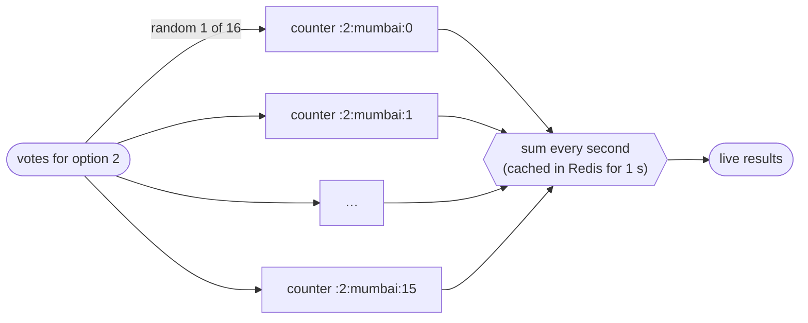
```mermaid
flowchart LR
    V([votes for option 2]) -->|random 1 of 16| C0["counter :2:mumbai:0"]
    V --> C1["counter :2:mumbai:1"]
    V --> C2["…"]
    V --> C15["counter :2:mumbai:15"]
    C0 & C1 & C2 & C15 --> SUM{{"sum every second<br/>(cached in Redis for 1 s)"}}
    SUM --> R([live results])
```

- **Live results** = the sum of the counters, computed at most **once per second per API server** and pushed to everyone watching.
- The vote itself is written with `w: majority`; the counter increment is best-effort (`w: 1`). If an increment is ever lost (for example rolled back during a failover), the **live** count may be off by a little.
- That's why the **final** results come from a **full recount of every vote** when the poll closes. The worker also stores the difference ("drift") between the live counter and the exact count, so you can see it.

> [!TIP]
> We tested this by deleting one counter increment on purpose: the live total dropped from 12 to 11, and when the poll closed the recount published **12**, with *"drift of 1"* shown on the results page.

### 8.5 Replication and read-your-writes

> [!NOTE]
> **In simple words:** the replica is a copy of the database that is always *slightly* behind. If you create a poll and immediately read from the copy, your poll isn't there yet. The fix: after you write something, **your** reads go to the original until the copy has caught up.

<div align="center">
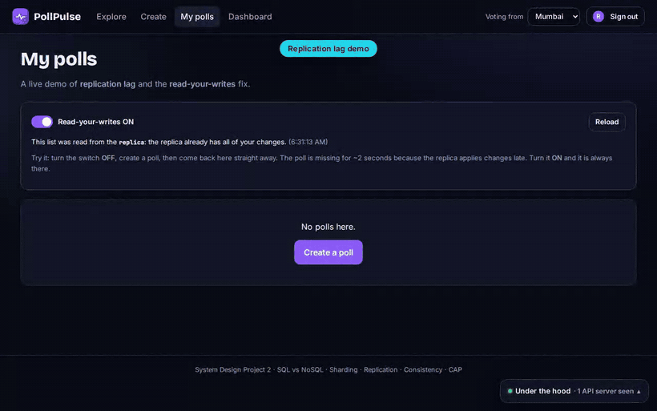
</div>

This project makes the replica apply changes **2 seconds late on purpose** (`recovery_min_apply_delay`), because real lag on a laptop is a few milliseconds, too fast to see.

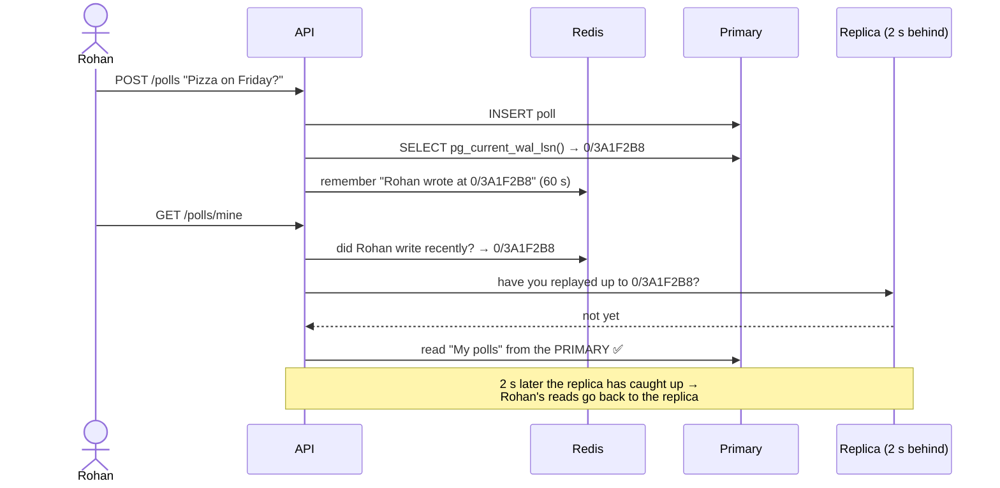
```mermaid
sequenceDiagram
    actor U as Rohan
    participant API
    participant R as Redis
    participant P as Primary
    participant RP as Replica (2 s behind)
    U->>API: POST /polls "Pizza on Friday?"
    API->>P: INSERT poll
    API->>P: SELECT pg_current_wal_lsn() → 0/3A1F2B8
    API->>R: remember "Rohan wrote at 0/3A1F2B8" (60 s)
    U->>API: GET /polls/mine
    API->>R: did Rohan write recently? → 0/3A1F2B8
    API->>RP: have you replayed up to 0/3A1F2B8?
    RP-->>API: not yet
    API->>P: read "My polls" from the PRIMARY ✅
    Note over API,RP: 2 s later the replica has caught up →<br/>Rohan's reads go back to the replica
```

The trick uses PostgreSQL's **WAL position** (LSN, the log sequence number): a number that grows with every change. It lets the API know *exactly* when the replica has caught up, instead of guessing with a timer. Other users are unaffected; their reads keep going to the replica.

| `npm run demo:replication` | Result |
|---|---|
| Read-your-writes **OFF** | The new poll is **missing for ~2,070 ms** (8 reads in a row) |
| Read-your-writes **ON** | Visible **every time**: routed to the primary until the replica caught up, then back to the replica |

<details>
<summary><b>Show the terminal output</b></summary>
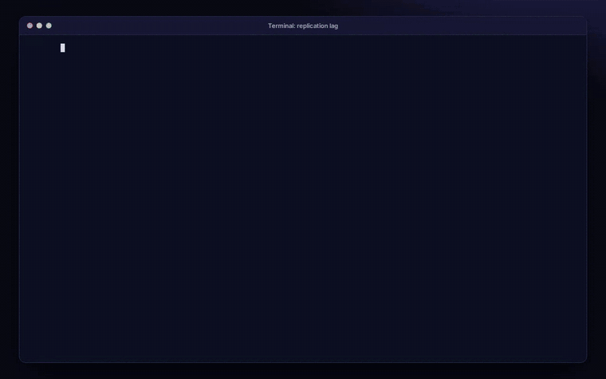
</details>

**A second, simpler technique** is also used: if a poll page is requested and the replica doesn't have that poll yet, the API reads it from the primary instead of returning 404. That's why a brand-new poll page always loads.

### 8.6 Consistency models

> [!NOTE]
> **In simple words:** when there are several copies of your data, "reading" can mean different things. Do you want the **guaranteed newest** answer, the **fastest nearby** answer, or "nearby, but at least as new as what I just did"?

Every shard has a copy in each region. When you read your vote back, you choose:

| Level | Reads from | Can return old data? | Cost |
|---|---|---|---|
| **Strong** | The shard's primary (Mumbai) | ❌ Never | Farther away, and the primary does all the work |
| **Eventual** | The nearest copy in your region | ✅ Yes, if that copy is behind | Fastest |
| **Causal** | The nearest copy, but with `afterClusterTime` = the moment of **your** vote | ❌ Never older than your own writes; it **waits** instead | Close, but may wait |

How causal works here: after your vote is saved, the API stores the cluster time of that write (in Redis). A causal read passes that time to MongoDB, and a secondary that hasn't reached it yet **waits** until it has (up to 3 s), instead of returning stale data.

**See it yourself:** `npm run demo:consistency` makes the **Virginia** copies fall behind on purpose (`db.fsyncLock()` stops them from applying new writes), votes, then reads the vote back from Virginia:

```
STRONG    found your vote ✓            (read the primary)
EVENTUAL  vote MISSING ✗ (stale read)  (Virginia is behind)
CAUSAL    waited…  The virginia copy is behind. A causal read waits for it
          instead of returning stale data (gave up after 3000 ms).
— unlock Virginia —
STRONG / EVENTUAL / CAUSAL   found your vote ✓
```

You can also try it in the UI: after voting, the **"Read my vote back"** card on the poll page runs all three.

### 8.7 CAP theorem and network partitions

> [!NOTE]
> **In simple words:** when the network between regions breaks (a "partition"), a system must choose: **refuse** some requests so the data stays correct (**C**onsistency), or **answer** everything and risk wrong or lost data (**A**vailability). You can't have both during a partition. The interesting part is that you can choose **differently for different data**.

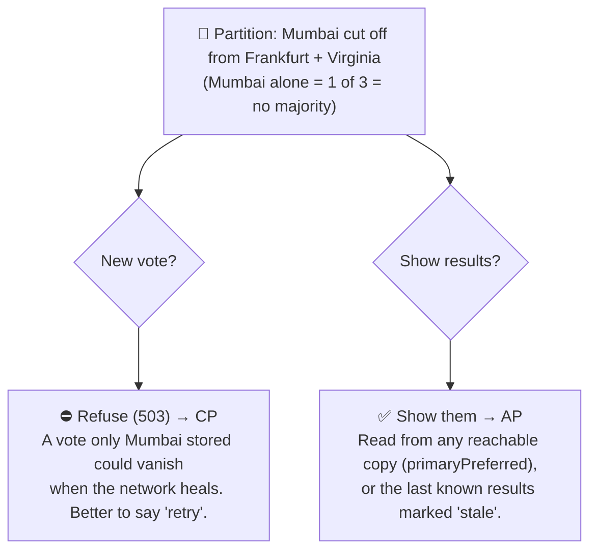
```mermaid
flowchart TD
    P["🔌 Partition: Mumbai cut off from Frankfurt + Virginia<br/>(Mumbai alone = 1 of 3 = no majority)"] --> V{New vote?}
    P --> R{Show results?}
    V --> VC["⛔ Refuse (503) → CP<br/>A vote only Mumbai stored could vanish<br/>when the network heals. Better to say 'retry'."]
    R --> RA["✅ Show them → AP<br/>Read from any reachable copy (primaryPreferred),<br/>or the last known results marked 'stale'."]
```

| Data | Choice | During a partition |
|---|---|---|
| **Votes** | **CP** (`w: majority`) | Refused with `503` until a majority can confirm |
| **Live results** | **AP** (`primaryPreferred`, last-known fallback) | Still shown; they just stop moving (no new votes are accepted anyway) |
| **Final results** | **Strong** | The worker recounts with `readConcern: majority` from primaries; it simply retries later |

**See it yourself:** `npm run demo:partition` freezes the Frankfurt and Virginia members (`docker compose pause a2 a3 b2 b3`) for 25 seconds, probing once a second:

- **First ~10 s:** votes time out waiting for a majority → `503 VOTE_NOT_CONFIRMED`.
- **Then:** Mumbai realizes it is in the minority and **steps down**; votes now fail fast → `503 VOTE_STORE_UNAVAILABLE`.
- **The whole time:** results keep answering `200`.
- **After unpausing:** a primary is elected again and votes are counted within seconds, with no human action.

We also tested the extreme case of the whole vote store going down: votes were refused in **20 ms** with a clear message, results kept serving the last known numbers marked `stale`, and everything recovered by itself.

### 8.8 Failover

> [!NOTE]
> **In simple words:** each shard has 3 copies. One is the boss (primary) and takes the writes. If the boss dies, the other two notice (heartbeats every 2 s) and hold a vote among themselves (an election). Whoever wins becomes the new boss, usually within about 10 seconds.

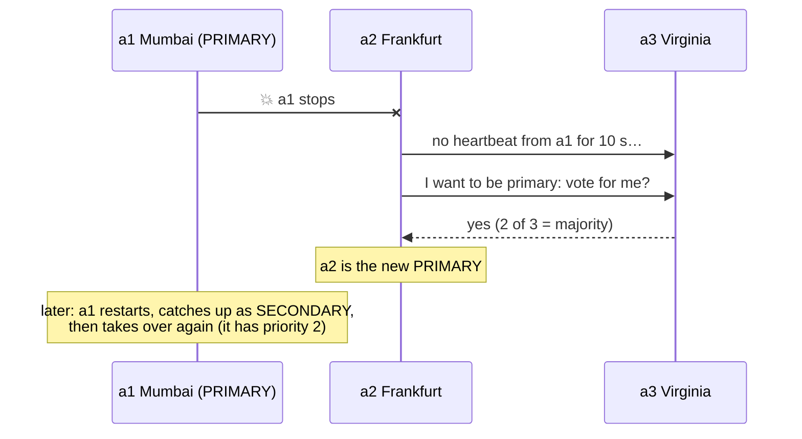
```mermaid
sequenceDiagram
    participant A1 as a1 Mumbai (PRIMARY)
    participant A2 as a2 Frankfurt
    participant A3 as a3 Virginia
    A1-xA2: 💥 a1 stops
    A2->>A3: no heartbeat from a1 for 10 s…
    A2->>A3: I want to be primary: vote for me?
    A3-->>A2: yes (2 of 3 = majority)
    Note over A2: a2 is the new PRIMARY
    Note over A1: later: a1 restarts, catches up as SECONDARY,<br/>then takes over again (it has priority 2)
```

**Why no acknowledged vote is lost:** a vote is only "counted" after **2 of 3** members have it. Any 2 members that can elect a new primary include at least one that has the vote, and the election always picks a member with the newest data.

**See it yourself:** `npm run demo:failover` votes at ~10/s, stops the shard-a primary after 5 s, restarts it at 22 s, then:
- prints a per-second chart of counted vs refused votes. Only votes that land on shard-a are refused, and only during the election; shard-b keeps working throughout.
- retries every refused vote (some come back as `ALREADY_COUNTED`: they were saved just before the error, which is exactly why retries must be safe)
- counts the votes in MongoDB and checks **acknowledged votes lost = 0**

### 8.9 Indexing

> [!NOTE]
> **In simple words:** an index is like the index at the back of a book. Without it, the database reads every page (all 200,000 polls) to find what you asked for. With it, it jumps straight to the right place.

<div align="center">
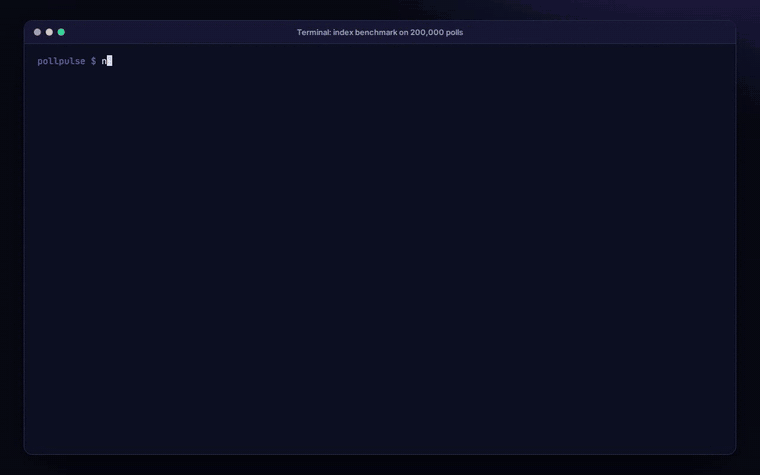
</div>

`npm run demo:indexes` runs `EXPLAIN ANALYZE` on 200,000 polls, first with the indexes, then with them dropped inside a transaction that is **rolled back** (so nothing is really removed):

| Query | Index | With | Without | Faster |
|---|---|---|---|---|
| Newest public polls (home feed) | `(created_at DESC) WHERE visibility = 'public'` | **0.04 ms** | 68.6 ms | **~1,850×** |
| "My polls" for one creator | `(creator_id, created_at DESC)` | **0.06 ms** | 68.4 ms | **~1,100×** |
| Worker: open polls due to close | `(closes_at) WHERE status = 'OPEN'` (partial) | **0.01 ms** | 48.9 ms | **~3,200×** |
| Full-text search "night trains" | `GIN (search tsvector)` | **10.6 ms** | 63.8 ms | **~6×** |

Without an index, every query reads all **15,836 pages** of the table. Two lessons:
- **Partial indexes** (`WHERE status = 'OPEN'`) are tiny because they only cover the few rows you actually query. The worker's index has just a handful of entries out of 200,000 rows.
- **Search speeds up "only" 6×** because ~800 polls match "night trains", and every match still has to be **ranked**. Indexes find rows fast, but can't avoid work on rows you really need.

MongoDB side: the hashed `_id` shard key doubles as the index for vote lookups, and `{ pollId: 1 }` indexes the counters that live results read.

### 8.10 Live results: Server-Sent Events

> [!NOTE]
> **In simple words:** instead of every browser asking "anything new?" every second, the browser opens **one** connection and the server **pushes** new results down it every second.

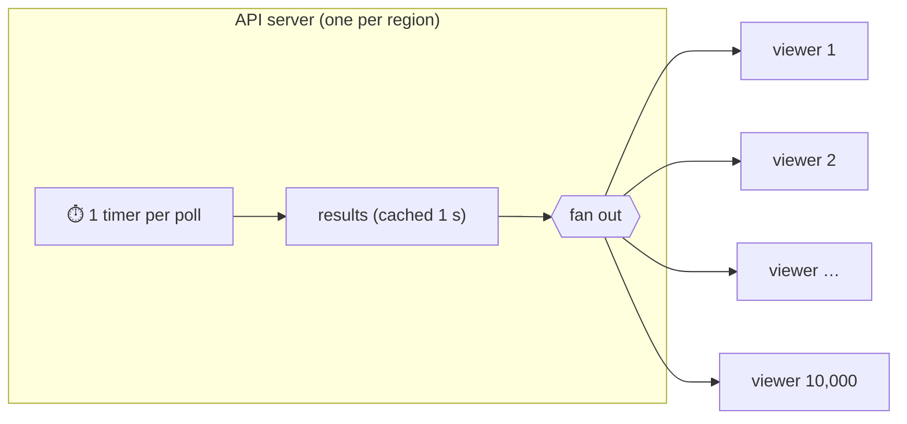
```mermaid
flowchart LR
    subgraph "API server (one per region)"
        T["⏱️ 1 timer per poll"] --> C["results (cached 1 s)"]
        C --> F{{fan out}}
    end
    F --> B1[viewer 1]
    F --> B2[viewer 2]
    F --> B3[viewer …]
    F --> BN[viewer 10,000]
```

- **One query per second per server per poll**, whether 1 or 10,000 people are watching.
- Built on plain HTTP: works through Nginx (with `proxy_buffering off`) and reconnects by itself (`EventSource`) if the server restarts. Usually it lands on a different server, and the user doesn't notice.
- Simpler than WebSockets because data only flows one way (server → browser). Two-way real-time with WebSockets is Project 5's topic.

## 9. Live Dashboard

- 📈 **Votes per second**, in total and per region, for the last 60 seconds
- 🔥 **Hottest poll**, with live results from the sharded counters
- 🍃 **MongoDB cluster**: which member of each shard is PRIMARY, with health and lag per region
- 🧩 **Votes per shard**: proof that the hashed shard key spreads the load
- 🐘 **PostgreSQL replication**: lag in milliseconds, bytes waiting to be applied, with a lag chart
- 🖥️ **API servers**: health of every server and its connections (primary, replica, MongoDB, Redis)

<div align="center">
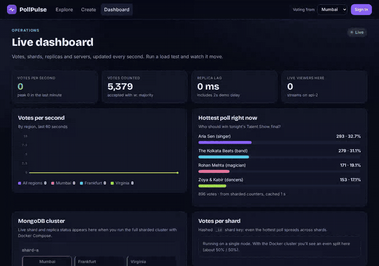
<br/><sub>A k6 load test sends 100 votes per second from three regions (shown at 3× speed). Votes per second jumps, the hottest poll switches to the test poll, and replica lag stays near the 2 s demo delay.</sub>
</div>

| During the vote storm | Replication and API servers |
|---|---|
| 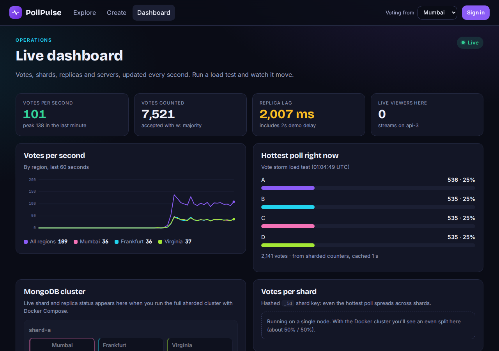 | 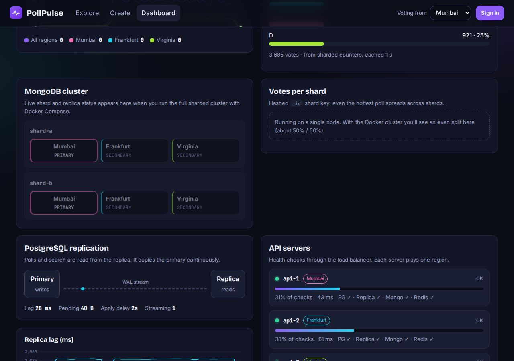 |

> [!TIP]
> Keep the dashboard open while running `npm run demo:failover` or `npm run demo:partition`, and you'll see members turn from PRIMARY to DOWN and a new PRIMARY appear in another region.

## 10. Failure Scenarios

| What goes wrong | What happens | Why |
|---|---|---|
| **Same vote sent many times at once** | Counted once; the others get `ALREADY_COUNTED` | `_id = pollId:userId` is unique across the cluster ✅ *tested* |
| **User tries to change their vote** | `409 ALREADY_VOTED` | Same `_id`, different option ✅ *tested* |
| **A shard's primary dies** | That shard's votes get `503` for ~10 s during the election, then work again; other shards unaffected | Replica-set election; the API caps each vote at 8 s |
| **Mumbai is cut off (partition)** | Votes refused (CP), results still shown (AP), automatic recovery | `w: majority` vs `primaryPreferred` |
| **The whole vote store is down** | Votes refused in ~20 ms; results show last known numbers marked "stale" | Stale-on-error fallback ✅ *tested* |
| **Vote store overloaded** | Votes that take > 8 s get `503`; **no acknowledged vote is lost**; some "refused" ones were in fact saved, and retrying returns `ALREADY_COUNTED` | Timeouts + idempotent retries ✅ *tested* |
| **A live counter increment is lost** | Live total slightly low; **final results exact** | Recount at close ✅ *tested* |
| **Replica is behind** | Feeds are a moment old; your own polls are always visible | Read-your-writes ✅ *tested* |
| **Replica dies** | Reads move to the primary automatically for a while | Circuit breaker in the read router |
| **PostgreSQL primary dies** | No new polls or logins; votes on existing polls continue (poll details are cached) | ⚠️ No automatic PostgreSQL failover here (see Limitations) |
| **An API server dies** | Nginx sends traffic to the others; live-result streams reconnect elsewhere | Stateless servers, same as Project 1 |
| **Redis dies** | Rate limiter fails open; caches fall back to the databases; read-your-writes plays safe and reads the primary | Nothing correctness-critical lives only in Redis |

## 11. Trade-offs & Alternatives Considered

| Decision | Chosen | Alternative | Why |
|---|---|---|---|
| Vote store | MongoDB, sharded | Cassandra, DynamoDB, sharded PostgreSQL | Easy to run locally, shows sharding + replica sets + tunable consistency in one system. Cassandra would suit even larger scale (leaderless, AP by default). |
| Shard key | Hashed `pollId:userId` | `pollId`, `createdAt`, `userId` | The only option that spreads a viral poll **and** enforces one vote per person |
| Counting | 16 sharded counters + recount at close | One counter; count votes on every request; a stream processor | One counter is a hot spot; counting on every request is too slow; streaming (Kafka) is Project 3's topic |
| Vote durability | `w: majority` | `w: 1` | `w: 1` is faster, but a vote can vanish in a failover. For votes, correctness wins. |
| Live results | AP (`primaryPreferred`, stale fallback) | CP (primary only) | Showing slightly old results beats showing an error to millions of viewers |
| Read-your-writes | WAL position (LSN) check | Read primary for N seconds after writing; always read primary | Exact: goes back to the replica the moment it catches up |
| Live updates | Server-Sent Events | Polling; WebSockets | One-way push over plain HTTP; WebSockets are Project 5's topic |
| Regions | Simulated with tags on one machine | Real multi-region cloud deployment | Free, runs on a laptop; latency between regions is not simulated |

## 12. Load Test Results

> [!NOTE]
> **Reference run:** a small cloud VM with **2 CPU cores**, with every part of the system **and** the k6 load generator on the same machine. To fit that machine, the vote store was a **single MongoDB-compatible node** instead of the 7-node sharded cluster. So treat the throughput numbers as a floor for a very small setup, and the **correctness** results (nothing lost, nothing double-counted) as the important part. Run the tests on the full cluster to get your own numbers ([How to Run](#-run-the-load-tests)).

### Test 1: Vote storm (150 new votes/second for 30 s, one poll, three regions)

| | Result |
|---|---|
| Votes sent / counted | 4,500 / **4,500** ✅ |
| Failed requests | **0%** |
| Vote time: median / p95 / p99 | **8 ms** / 128 ms / 348 ms |
| Live results total afterwards | **4,500** (exact match) |

**Pushing to 300 votes/s** found the limit of the single-node stand-in: it could only handle about 150-200 writes per second on 2 shared cores. What happened is a lesson in itself:

| | Result |
|---|---|
| Acknowledged by the API (`201`) | 1,970 |
| Refused with `503` (timed out after 8 s) | 4,205 |
| Actually stored in the vote store | 2,101 |
| **Acknowledged votes lost** | **0** ✅ |

131 of the "refused" votes had in fact been saved; their timeout came *after* the write. That's exactly why a vote must be safe to retry: retrying returns `ALREADY_COUNTED`, never a second vote. The system slowed down and pushed back (`503`, "please retry") instead of losing or double-counting votes.

### Test 2: Double votes (300 users, each sending the same vote 5 times in parallel)

| | Result |
|---|---|
| Requests | 1,500 |
| Counted (`201`) | **300** ✅ (exactly one per user) |
| `ALREADY_COUNTED` (`200`) | 1,200 |
| Over-counted | **0** |
| Live results total | **300** |

### Test 3: Watchers (500 reads/second: 70% results, 20% feeds, 10% search)

| | Result |
|---|---|
| Requests | 15,001, **0 failed** |
| Live results: median / p95 / p99 | **1.1 ms** / 4.8 ms / 18 ms |
| Served from the Redis cache | **99.1%** |

### Other checks

| Check | Result |
|---|---|
| `npm test` (end-to-end) | **15 / 15 passing** |
| `npm run demo:double-vote` | 5 identical votes → 1 counted; 45 more → 45 × `429`; 100 fans → exactly 101 total |
| `npm run demo:replication` | Missing for ~2,070 ms without read-your-writes; always visible with it |
| `npm run demo:indexes` | 6× to ~3,200× faster with indexes (table in [8.9](#89-indexing)) |
| Recount at close with a lost counter increment | Live 11 → final **12**, drift 1 recorded |
| Vote store stopped completely | Votes refused in 20 ms; results served as `stale`; recovered automatically |
| PostgreSQL replication scripts (`00-replication.sh`, `replica-entrypoint.sh`) | Base backup + streaming with password login + 2 s delay, all working |

## 13. Limitations & What I'd Do Differently

- 🐘 **PostgreSQL has no automatic failover.** The replica is only for reads. Production would use Patroni (or a managed database) to promote the replica automatically.
- 🌍 **Regions are simulated.** Everything runs on one machine, so there is no real network delay between "Mumbai" and "Virginia". Adding latency with a tool like Toxiproxy or `tc netem` would make the consistency trade-offs even more visible.
- 🧮 **Live counters can drift** if an increment is lost (only fixed at close). A change stream or a Kafka consumer that updates counters from the votes themselves would be exact and fully decoupled. *(Queues and streams: Project 3.)*
- 🔐 **Demo login.** One vote per *account*, not per *human*. Real voting needs verified identities (phone/OTP), bot detection and fraud analysis.
- 📡 **Server-Sent Events hold one connection per viewer on the API servers.** At millions of viewers you would move pushing to a dedicated service or a pub/sub layer. *(Project 5.)*
- ⚙️ **One worker, no leader election.** Its jobs are safe to run twice, but proper leader election is Project 5's topic.
- 🔒 **No authentication inside the cluster.** MongoDB and PostgreSQL trust the Docker network. Production needs TLS, users and keyfiles.

## 14. Tech Stack

| Layer | Technology | Why |
|---|---|---|
| API + worker | **Node.js 22, Express 5** | Same as Project 1; great for many small I/O-bound requests |
| Votes | **MongoDB 7**: 2 shards × 3-member replica sets, config server, `mongos` | Built-in sharding, replica sets and tunable consistency (`w`, `readPreference`, causal sessions) |
| Polls, users, search | **PostgreSQL 16** + streaming read replica | Relations, full-text search (GIN), `EXPLAIN ANALYZE`, WAL positions for read-your-writes |
| Cache, limits, stats | **Redis 7** | Sub-millisecond; atomic Lua rate limiter |
| Edge | **Nginx 1.27** | Load balancing + streaming Server-Sent Events |
| Frontend | **React 19 + Vite** | Live results via `EventSource`; self-hosted fonts |
| Infrastructure | **Docker Compose** | 17 services from one command |
| Testing | **Node test runner, k6** | End-to-end tests; load tests |

## 15. Project Structure

```
pollpulse/
├── api/                              # Node.js API + worker (same Docker image)
│   └── src/
│       ├── server.js / worker.js     # HTTP server · poll closer + trending sync
│       ├── config.js                 # every setting (environment variables)
│       ├── db/pg.js                  # primary + replica pools, read-your-writes routing
│       ├── db/mongo.js               # vote store, write concern, read preferences, cluster status
│       ├── redis.js                  # rate limiter (Lua) + key names
│       ├── lib/ · middleware/        # cache, errors, validation, auth, rate limit, logging
│       └── modules/
│           ├── polls/                # create, feeds, search, "My polls"
│           ├── votes/                # cast a vote, read it back (strong/eventual/causal)
│           ├── results/              # sharded-counter totals + Server-Sent Events hub
│           ├── auth/ · ops/          # demo login · dashboard data
├── web/                              # React app (explore, vote, create, my polls, dashboard)
├── nginx/                            # load balancer + SSE config
├── db/
│   ├── postgres/                     # schema, 200k seed polls, replication setup
│   └── mongo/                        # replica sets + sharding setup
├── scripts/                          # the demos (double vote, replication, consistency,
│   └── mongo/                        #   shard key, failover, partition, indexes)
├── tests/e2e.test.mjs                # 15 end-to-end tests
├── load-tests/                       # k6: vote storm, double votes, watchers
├── docs/                             # architecture image, screenshots, demo GIFs + videos
├── docker-compose.yml                # 17 services
├── .env.example                      # every setting you can change
└── .env.loadtest                     # lifts per-IP limits for load tests and demos
```

## 16. How to Run

### What you need

- **Docker Desktop** (Windows / macOS) or Docker Engine + Compose v2 (Linux), with **at least 4 GB of memory** for Docker (7 MongoDB processes run at once)
- **Node.js 20+**, only for the tests and demo scripts
- Free ports: `8080` (app), `5434` / `5435` (PostgreSQL primary / replica), `27020` (MongoDB router)

### 1. Start everything

```bash
git clone <your-repo-url> pollpulse
cd pollpulse
docker compose up --build -d
```

The first start takes a few minutes: images download, 200,000 polls are seeded, the replica copies the primary, and the MongoDB cluster is set up. Watch it with:

```bash
docker compose logs -f mongo-init pg-replica    # "cluster ready" and "base backup complete"
docker compose ps                               # api1, api2, api3 should be "healthy"
```

### 2. Open the app

| Page | URL |
|---|---|
| 🗳️ App | **http://localhost:8080** |
| 📊 Live dashboard | **http://localhost:8080/#/dashboard** |

**Things to try:**

1. 🗳️ Vote on *"Who should win tonight's Talent Show final?"*, then open the same poll in a private window as someone else and vote again. Watch both screens update.
2. ☝️ Click a vote button many times quickly. Counted once.
3. 🌍 Change **"Voting from"** at the top, vote on another poll, and see the region split.
4. 🔁 After voting, use **"Read my vote back"** (strong / eventual / causal).
5. ⏳ Go to **My polls**, turn **read-your-writes OFF**, create a poll, and come straight back. It's missing for ~2 s. Turn it ON and try again.
6. 🔎 Search for *"python"*, *"night trains"* or *"chess"*.
7. 🏁 *"Tea or coffee?"* closes 20 minutes after setup. Open it afterwards to see the exact recount.

### 3. Run the tests

```bash
npm test                    # 15 end-to-end tests against http://localhost:8080
```

### 🧪 Run the demos

Each demo prints a step-by-step explanation in the terminal. Keep the dashboard open next to it.

| Command | Teaches | Needs |
|---|---|---|
| `npm run demo:double-vote` | One person, one vote (uniqueness + idempotency) | app running |
| `npm run demo:replication` | Replication lag and read-your-writes | app running |
| `npm run demo:indexes` | Indexing with `EXPLAIN ANALYZE` | app running |
| `npm run demo:shard-key` | Hashed vs `pollId` shard key; targeted vs scatter-gather queries | full cluster |
| `npm run demo:consistency` | Strong vs eventual vs causal reads | full cluster |
| `npm run demo:failover` | Primary dies → election → no acknowledged vote lost | full cluster + load-test profile |
| `npm run demo:partition` | CAP: votes CP, results AP, automatic recovery | full cluster |

The failover demo signs in 400 voters from your machine, so first restart with the profile that lifts the per-IP login limit:

```bash
docker compose --env-file .env.loadtest up -d
npm run demo:failover
```

### 🔥 Run the load tests

```bash
docker compose --env-file .env.loadtest up -d          # lifts only the per-IP limits

docker compose --profile loadtest run --rm k6 run /scripts/01-vote-storm.js
docker compose --profile loadtest run --rm k6 run /scripts/02-double-votes.js
docker compose --profile loadtest run --rm k6 run /scripts/03-watchers.js

# change the load:
docker compose --profile loadtest run --rm -e RATE=1000 -e DURATION=60 k6 run /scripts/01-vote-storm.js
```

Go back to normal settings with `docker compose up -d`.

### Useful commands

```bash
# MongoDB
docker compose exec mongos mongosh pollpulse --eval 'sh.status()'                # shards and chunks
docker compose exec a2 mongosh --eval 'rs.status().members.map(m => [m.name, m.stateStr])'
docker compose exec mongos mongosh pollpulse --eval 'db.votes.getShardDistribution()'

# PostgreSQL
docker compose exec pg-primary psql -U pollpulse -c 'SELECT client_addr, state, replay_lag FROM pg_stat_replication'
docker compose exec pg-replica psql -U pollpulse -c 'SELECT pg_is_in_recovery()'

# Break things (and watch the dashboard)
docker compose stop a1            # shard-a primary dies → election
docker compose start a1
docker compose pause a2 a3 b2 b3  # partition: Mumbai alone
docker compose unpause a2 a3 b2 b3
docker compose stop pg-replica    # reads fall back to the primary

# Logs
docker compose logs -f api1 api2 api3 worker
```

Working on the frontend with live reload (backend in Docker):

```bash
cd web && npm install && npm run dev       # http://localhost:5173, API calls go to :8080
```

### Start again with fresh data

```bash
docker compose down -v      # -v deletes all database volumes
docker compose up -d
```

### Settings

Every setting is in [`.env.example`](.env.example). Copy it to `.env` and change it. Some fun ones:

- `READ_YOUR_WRITES=off`: see the replication bug everywhere
- `REPLICA_APPLY_DELAY=10s`: make replication lag really obvious
- `VOTE_WRITE_CONCERN=1`: faster votes, but a vote can be lost in a failover (try `demo:failover`)
- `COUNTER_SHARDS=1`: one counter per option and region, the hot spot the design avoids

### Troubleshooting

| Problem | Fix |
|---|---|
| API servers never become healthy | The first start seeds 200,000 polls and sets up the cluster. Check `docker compose logs mongo-init pg-replica`. On a slow machine give it a few minutes. |
| `mongo-init` exited with an error | Run `docker compose up -d` again. The setup script is safe to re-run. |
| Containers restarting / out of memory | Give Docker more memory (4 GB or more) in Docker Desktop settings |
| Port already in use | Change the left-hand port in `docker-compose.yml` (e.g. `"8081:80"`) |
| Lots of `429`s in demos or load tests | Use `docker compose --env-file .env.loadtest up -d` |
| Changes to `db/**` not applied | Databases are only initialised on empty volumes: `docker compose down -v` |

---

## License

[MIT](LICENSE)

<div align="center">

⭐ **If this helped you understand distributed data, star the repo and follow along for Projects 3-5.**

</div>
